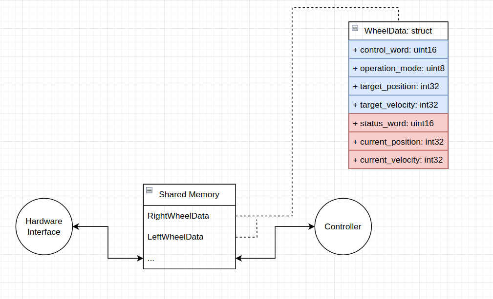

# EtherCAT Motor Control System

A ROS2-compatible EtherCAT motor control system for differential drive robots with digital I/O capabilities.

## Overview

This project implements real-time motor control and I/O handling using EtherCAT for differential drive mobile robots. The system features:

- Velocity-mode motor control for differential drive
- Synchronized EtherCAT communication
- Digital I/O module support
- ROS2 integration for robot control

## Dependencies

- ROS2
- IgH EtherCAT Master
- Real-time kernel support
- ROS2 messages:
  - nav_msgs
  - geometry_msgs
  - sensor_msgs
  - amr_custom_interfaces

## Architecture

The system consists of three main components:

1. EtherCAT Communication (`ecat_hardware.cpp`) - Handles real-time EtherCAT communication
2. Motion Control (`controller.cpp`) - Implements motor control and odometry
3. ROS 2 Interface (`ros_communication.cpp`) - Manages ROS2 integration

## Building

Running the installation script, install.sh, with the proper setup should install all necessary executables and systemd services.

### Installation Steps

1. Source the ROS 2 workspace and the general ROS 2 setup file:

```bash
source /path/to/ros2_setup/setup.bash
source /path/to/workspace/install/setup.bash
```

2. Run the installation script:

```bash
sudo ./install.sh
```

## Usage

The systemd services _ecat_hardware_ and _ecat_control_ should start automatically during boot. In order to debug, the systemctl CLI can be used.

```bash
  systemctl start ecat_hardware.service // To start the service
  systemctl status ecat_hardware.service // To check the status of the service
  systemctl stop ecat_hardware.service // To kill the service
```

## How to edit the code

### Adding a new slave
To add a new slave, the guidelines provided by IgH EtherCAT master must be followed.
Three main components are needed in order to add a slave to the system:
1. **ec_pdo_entry_info array that consists of:** 
```cpp 
// An example can be found in line 38 in ecat_hardware.cpp
ec_pdo_entry_info_t entry_info_array[] = {Index, Subindex, Size of the object}, // ...
```
2. **ec_pdo_info array that points to the respective PDO entry inside the ec_pdo_entry_info array:**
```cpp
// An example can be found in line 41 in ecat_hardware.cpp
ec_pdo_info_t pdo_info[] = {Index, Subindex, entry_info_array + INDEX RESPECTIVE TO THE entry_info_array}

```
3. **Synchronization manager information points to the T/Rx PDO information:**
```cpp
// An example can be found in line 68 in ecat_hardware.cpp
ec_sync_info_t left_motor_slave_syncs[] = { { 0, EC_DIR_OUTPUT, 0, NULL, EC_WD_DISABLE },
{ 1, EC_DIR_INPUT, 0, NULL, EC_WD_DISABLE },
{ 2, EC_DIR_OUTPUT, 3, pdo_info + 0, EC_WD_DISABLE },
{ 3, EC_DIR_INPUT, 3, pdo_info + 3, EC_WD_DISABLE },
{ 0xff } };

```
4. **Domain entries: ec_pdo_entry_reg array that holds information about all the object that are to be registered inside a domain:**

```cpp
// Line 74 in ecat_hardware.cpp
const ec_pdo_entry_reg_t domainRegistries[] = {
  { SLAVE_ALIAS, SLAVE_START_POSITION, SLAVE_VENDOR_ID, SLAVE_PRODUCT_ID, 0x6040, 0x00, &RightMotorEthercatDataOffsets.control_word },
  /*
  .
  .
  .
  .
  .
   */
  {}
};

```
5. **Slave configuration procedure (in order) :**
    - ecrt_master_slave_config function must be called with the alias, position and vendor information of the slave:
    ```cpp
    ec_slave_config_t* slave_config_ptr = nullptr;
    slave_config_ptr = ecrt_master_slave_config(pointer_to_master, ALIAS, POSITION, VENDOR_ID, PRODUCT_ID);
    ```
    - ecrt_slave_config_pdos function must be called with the pointer to the current slave configuration and the sync manager configuration array:
    ```cpp
    if(ecrt_slave_config_pdos(slave_config_ptr, EC_END, SLAVE_SYNC_STRUCT_PTR) != 0)
    {
      // Error handling logic:
    }
    ```
    - **Optional:** If the slave is to be used with DC (distributed clock), ecrt_slave_config_dc function must be called in the following format:
    ```cpp
    ecrt_slave_config_dc(slave_config_ptr, ASSIGN_ACTIVATE, SYNC0_CYCLE, SYNC0_SHIFT, SYNC1_CYCLE, SYNC1_SHIFT);
    ```

### Changing the Ethercat Slave Configurations
In order to change the PDOs of the motor drivers, the offset struct, entry array and information array must be edited accordingly. 
**Note: Beckhoff motor drivers do not support arbitary PDO assignment, if an object is defined in a certain mapping index, a new index cannot be assigned to the object: for example, in order to use the status word object 0x1608 index must be used even though the mappings in 0x1602 and forward are empty.**
```cpp
struct
{
  uint control_word;
  uint operation_mode;
  uint target_position;
  uint target_velocity;
  uint status_word;
  uint current_position;
  uint current_velocity;
} RightMotorEthercatDataOffsets;

ec_pdo_entry_info_t right_motor_pdo_entries[] = { { 0x6040, 0x00, 16 }, { 0x60ff, 0x00, 32 }, { 0x6060, 0x00, 8 },  // input PDOs
{ 0x6041, 0x00, 16 }, { 0x6064, 0x00, 32 }, { 0x606c, 0x00, 32 } // , output PDOs 
}; 

ec_pdo_info_t right_motor_pdo_info[] = {
  {0x1600, 1, right_motor_pdo_entries + 0},
  {0x1601, 1, right_motor_pdo_entries + 1},
  {0x1608, 1, right_motor_pdo_entries + 2},
  // Add input PDOs here
  {0x1a00, 1, right_motor_pdo_entries + 3},
  {0x1a01, 1, right_motor_pdo_entries + 4},
  {0x1a02, 1, right_motor_pdo_entries + 5}
  // Add output PDOs here
};
```

### Changing digital I/O slaves:
I/O slave configurations follow a similar procedure to motor drivers, one difference is the need for bit position information. The offset and bit position information is assgined by the master.

### SDO configuration during setup:
The setupDriverFor24Volts function can be used as a template for setting SDO configuration for the slaves. Because the configuration is done during setup, the ecrt_slave_config_sdo* function family is used before starting the real-time loop in order to read and write to SDOs.

```cpp
SdoSetupError setupDriverFor24Volts(ec_slave_config* slave_config_ptr)
{
  if(ecrt_slave_config_sdo*(slave_config_ptr, index, subindex, value) < 0)
  {
    return SdoSetupError::DOWNLOAD_ERROR;
  }

}
```

## Reading/Writing values from/to the master
In order to communicate cyclically with the master, we make use of the macros provided by IgH, namely the EC_READ AND EC_WRITE. These macros are put inside the following template functions to improve readability:
```cpp
template <typename T>
std::optional<T> readFromSlave(uint8_t *domainDataPtr, uint object_offset, uint bit_position = 0);

template <typename T>
void writeToSlave(uint8_t *domainDataPtr, uint object_offset, const T &new_val, uint bit_position = 0);
```
These functions use the domain data pointer created by the ecrt_domain_data and the offset assigned to the object to retrieve the data starting from the offset index until the end of the objects size (T) and cast it back to the requested format.
The read operation returns and optional<T> object that can be checked before accessing the value to avoid any errors that might have occured during EC_READ or if an invalid type is passed as parameter. \
Before reading via readFromSlave functions, ecrt_master_receive function must be called in order to receive the datagrams from the master (line 556 of ecat_hardware.cpp).  
After the write functions are called, the domains must be queues via ecrt_domain_queue function (line 677 of ecat_hardware.cpp).Finally a call to the master must be made to actually send the queued data to the Ethernet device.

## Controller

The controller process is responsible for calculating the necessary values for controlling the robot.
- **Odometry:** Indicates the change in the position of the robot from it's starting point. 
- **Wheel velocity and position:** Uses the information coming from the drivers to calculate the actual velocity [rad/s] and the position [rad] of each wheel.
- **Robot commands:** Transforms velocity commands using differential drive kinematics coming from various sources to send target RPMs to the motor drivers.
- **Driver state machine:** Calculates the necessary control words to transition motor drivers states.

### Communicating with ROS 2
In order to receive and send data between the ROS network and the controller process, a separate thread is started alongside the main controller thread, that transmits data to/from ROS 2 via typical publishers and subscribers. 

## Communication between Hardware Interface and Controller
In order to increase performance and assure a soft real-time system, the two processes are seperated from each other. The data exchange between the two processes is established by opening a named shared memory segment and syncronized with a named semaphore. The shared memory procedure is done via functions and structures provided by Linux, so it should be portable.



The name of the memory segment and the semaphore can be adjusted by the **SHARED_MEMORY_SEG_NAME** and **ETHERCAT_DATA_SEM_NAME** variables inside the shared_obj.hpp file.

# AMR LED Controller Documentation

## Overview
This documentation covers the LED controller node implementation for an Autonomous Mobile Robot (AMR) and explains its key components and bitwise operations.

## Code Documentation

### Key Components

#### Enums
- `LedMode`: Defines different LED patterns using 3-bit encoding
- `HardwareState`: Represents different states of the hardware system

#### Helper Function
```cpp
template <typename E>
constexpr auto to_integral(E e) -> typename std::underlying_type<E>::type
```
Converts enum class values to their underlying integer type at compile time.

#### Main Program Flow

1. **Initialization**
   - Sets up subscription to "/hardware_info" topic
   - Establishes TCP connection to LED controller (IP: 192.168.2.177, Port: 3255)

2. **Hardware State Monitoring**
   - Subscribes to hardware information updates
   - Updates `generalState` based on motor driver status:
     - Sets OPERATION_ENABLED when drivers are operational
     - Sets ERROR state when faults are detected

3. **LED Control Logic**
   - Runs at 1Hz (controlled by `sleepRate`)
   - Only updates LED state when hardware state changes
   - Converts hardware states to 3-bit LED control signals
   - Controls two sets of RGB LEDs (pins 0-2 and 8-10)

4. **Communication**
   - Formats LED commands as JSON requests
   - Sends commands via TCP to the LED controller
   - Monitors communication errors

### Notes
- The `HardwareState` enum has duplicate values for ERROR and WARNING (both 0x1)
- LED control uses bitwise operations to split the state into RGB components
- The program continues running until ROS2 shutdown is triggered
- TCP connection errors will cause immediate program termination with code 2

## Bitwise Operations Explanation

### Bit Pattern Structure
Each LED mode/state is represented by a 3-bit pattern:

```cpp
enum class LedMode : uint16_t {
  OFF = 0x0,                // 000
  RED = 0x1,                // 001
  GREEN = 0x2,              // 010
  YELLOW = 0x4,            // 100
  BLUE = 0x3,              // 011
  WHITE = 0x5,             // 101
  WHITE_WITH_RED_ENDS = 0x6,// 110
  BOUNCING_BLUE = 0x7      // 111
};
```

### Bit Manipulation Operations
The code uses three main bitwise operations to extract individual bits:

```cpp
// First bit extraction
ledModeReq.requests[0] = std::make_tuple(0, IoRequest::RequestType::WRITE, (ledMode & 1));

// Second bit extraction
ledModeReq.requests[1] = std::make_tuple(1, IoRequest::RequestType::WRITE, ((ledMode & 2) >> 1));

// Third bit extraction
ledModeReq.requests[2] = std::make_tuple(2, IoRequest::RequestType::WRITE, (ledMode & 4) >> 2);
```

#### Operation Breakdown:

1. **First Bit (LSB)**
   - `ledMode & 1` (masks with `001`)
   - Extracts the least significant bit
   - Example: `011 & 001 = 001`

2. **Second Bit (Middle)**
   - `(ledMode & 2) >> 1` (masks with `010` then shifts right)
   - `&2` extracts middle bit
   - `>>1` shifts it to least significant position
   - Example: `011 & 010 = 010`, then `010 >> 1 = 001`

3. **Third Bit (MSB)**
   - `(ledMode & 4) >> 2` (masks with `100` then shifts right twice)
   - `&4` extracts most significant bit
   - `>>2` shifts it to least significant position
   - Example: `110 & 100 = 100`, then `100 >> 2 = 001`

These operations are repeated for both LED groups (pins 0-2 and 8-10) to maintain identical patterns.

## Modifying LED Modes

### How to Change LED Modes
1. The LED modes are defined in the `LedMode` enum class using 3-bit patterns
2. Each bit corresponds to one color in the RGB LED (Red, Green, Blue)
3. The pattern is encoded as a hexadecimal value (0x0 to 0x7)

### Adding New LED Modes
To add a new LED mode:

1. Change the LedMode enum according to the new mode
2. Change the HardwareState enum respective to the new mode
3. Add a new else if branch to the control structure inside the /hardware_info callback function.
